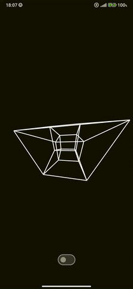
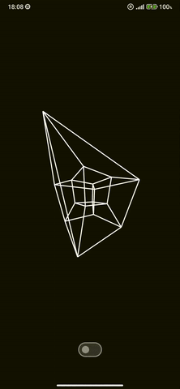

# GyroTesseract

---

## 🌀 Description

**GyroTesseract** is an experimental Android app that visualizes a rotating 4D hypercube (*tesseract*) projected onto a 2D canvas.  
It leverages **device motion sensors** (gyroscope, accelerometer, magnetometer) and touch gestures to offer an intuitive and interactive experience of a higher-dimensional object.

The tesseract can be rotated in real time by:

- Physically moving the phone using the **gyroscope**
- Dragging the screen with **inertia and deceleration**, simulating physical dynamics

This project explores how to render and interact with complex geometric spaces using modern Android tools.

---

>  *A playground for multidimensional thinking, physical interaction, and visual abstraction using Kotlin & Jetpack Compose.*

---

## 🚀 Features

✅ Real-time 4D → 3D → 2D projection and rendering  
✅ Rotation via rotation vector sensor (gyroscope)  
✅ Touch drag with natural **inertia + deceleration**  
✅ Seamless toggle between interaction modes  
✅ Smooth rendering with Compose Canvas  
✅ Lightweight, modular, and highly readable architecture  
✅ 100% documented Kotlin code with KDoc

---

## 🧰 Tech Stack

- **Kotlin**
- **Jetpack Compose**
- **Canvas & Modifier.graphicsLayer**
- **SensorManager (TYPE_ROTATION_VECTOR)**
- **Coroutines** for animation & drag handling

---

## 🖼️ Screenshots & Demos

| Auto-Rotation | Touch & Drag | Gyroscope |
|:---:|:---:|:---:|
|  |  |  |

---

## 📱 Usage Guide

- App launches in **gyroscope mode** by default  
- Tilt/rotate your device to see the tesseract react in 3D  
- Use the **toggle switch** to activate **drag mode**  
- Drag your finger on screen to rotate freely  
- Once released, the tesseract **slows down smoothly**, mimicking friction

---

> Made with ☕️, 🚀 and a touch of higher-dimensional geometry.
